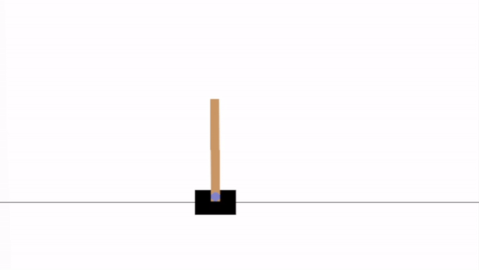
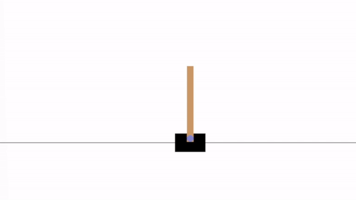
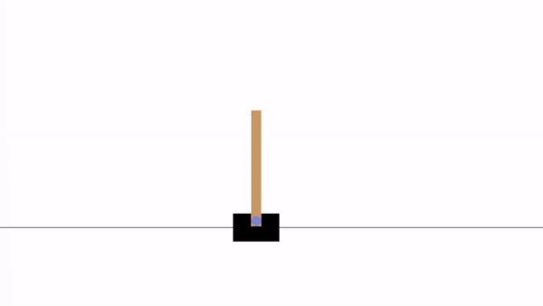
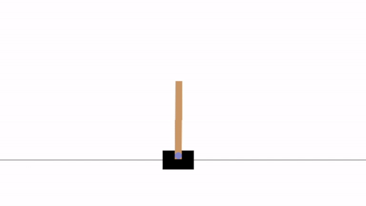

# Reinforcement Learning
## Team:
* Ben Tomlinson
## Requirements:
* See canvas assignment description
## How to run:
Run each module in order in the assignment.ipynb file

## Cart-Pole Baseline Training

    

In the above example, the baseline average reward was around 491.

## Modifying the Reward Function

    

The above example had an average reward of about 472. After testing this environment hundreds of times, I concluded that this modification did not consistently show improvements from the baseline model. Sometimes it performed better, and sometimes slightly worse. What I learned from this is that simply tweaking the reward function in a way that seems intuitive will not always have the result that you hope for. The reward function is a delicate balancing act that requires lots of trial and error.

## Modifying the Model Architecture

    

Above is an episode from the model using a custom neural network architecture that is acting in the original, unmodified environment. In this case, it scored an average reward of about 647. The custom architecture seems to improve the agent's ability to stay in the center of the screen for longer, which previous agents struggled with.

    

Above is an episode from the model using a custom neural network architecture that is acting in the custom environment with modified rewards. In this case, it scored an average reward of about 402.

I worked on this section for way longer than I needed to (at least 5 hours) because it was interesting to me, and because I kept getting some inconsistent results. 

Interestingly, when I implemented the cusom architecture but left the environment unchanged from the baseline one, I was seeing much higher average rewards than when I combined the custom architecture with the custom reward function. It is hard to explain why this might happen, but the only thing I can come up with is that the custom reward function might be flawed. I imagine that with more tweaking, the two custom elements combined could result in the best-performing agent yet. 
